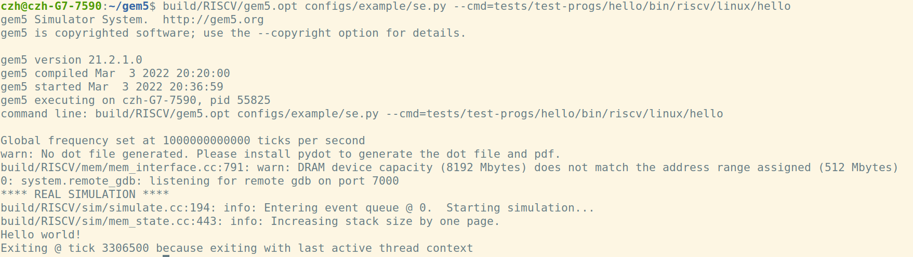
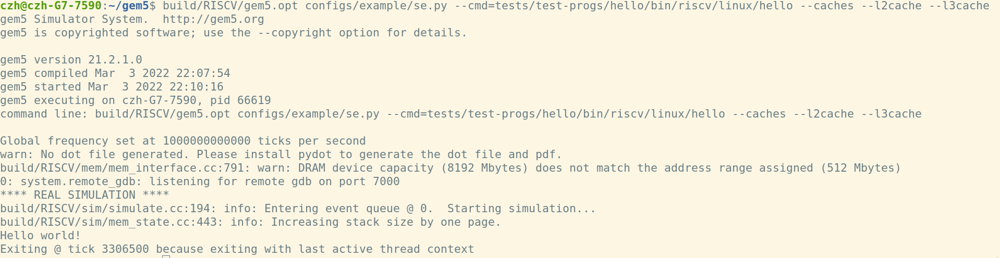
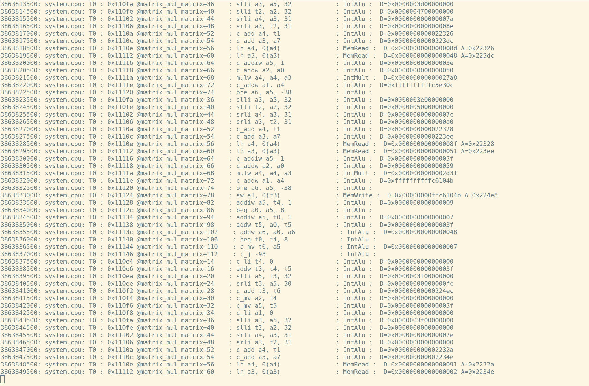
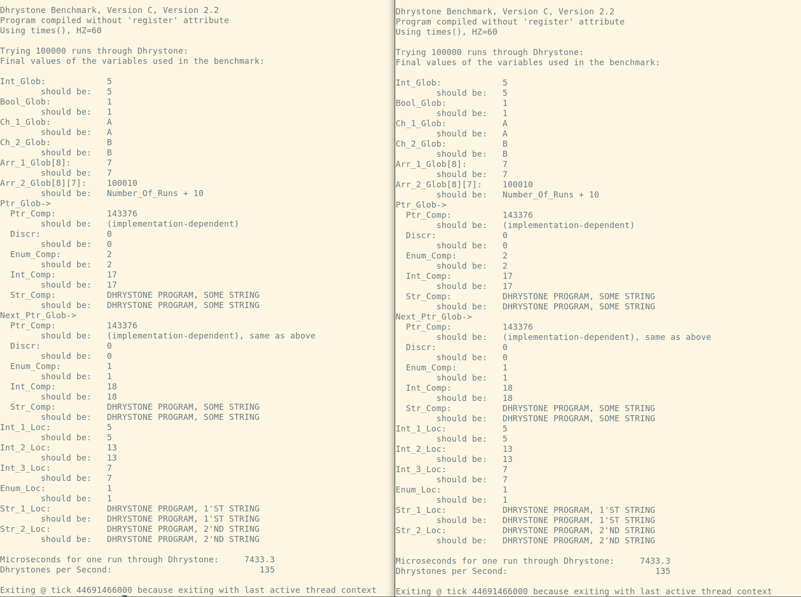
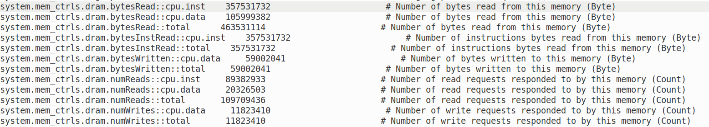
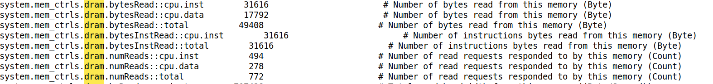
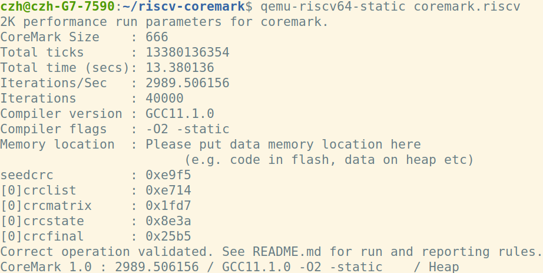
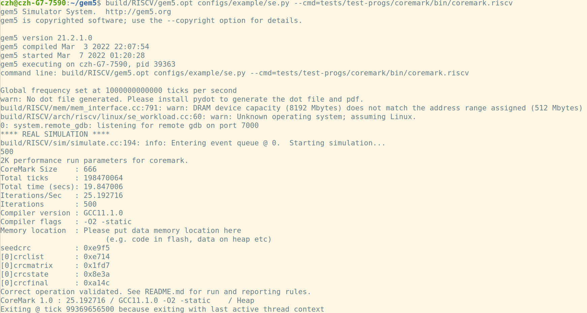
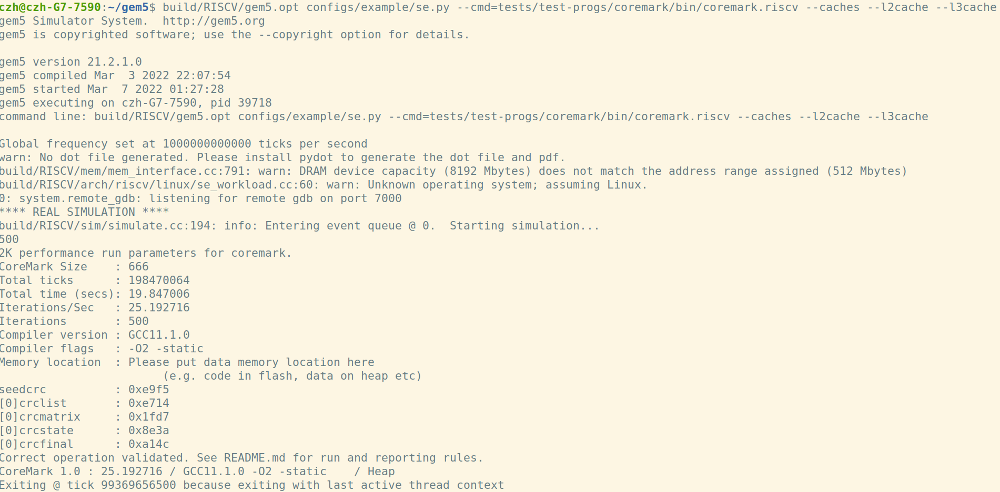

# micro-arch-learning

这是关于<a href=https://github.com/shinezyy/micro-arch-training>micro-arch-training</a>的一个learning过程，记录了@shinezyy给我布置的任务以及我们讨论过程中的一些有意义的问题

> micro-arch-learning的仓库只是一个学习过程的记录，并不是用于解答micro-arch-training的答案。micro-arch-training建立的目的并不是解决问题本身，而是学习解决过程的方法，成为一个**independent researcher**。

**周末多做做运动，不要长时间卷：）**


## 基础

1. [想做芯片？入门计算机系统结构的简略指南 - ArchShineZ的文章 - 知乎](https://zhuanlan.zhihu.com/p/400088344)

2. [【斯坦福大学】CS143 编译器（完结·中英字幕·机翻·人工校对中）](https://www.bilibili.com/video/BV17K4y147Bz?from=search&seid=18266980207417438154&spm_id_from=333.337.0.0)

3. [Wisc CS 752 Slide](https://pages.cs.wisc.edu/~sinclair/courses/cs752/fall2020/includes/schedule.html)
   1. Static ILP I
   2. Static ILP II
   3. Static ILP III / Dynamic ILP I
   4. Dynamic ILP II
   5.  Dynamic ILP III
   6.  Dynamic ILP IV
   7. Dynamic ILP V
   8. <a href="thesis/ieeemicro96_r10000.pdf">THE MIPS R10000  SUPERSCALAR  MICROPROC - Yeager</a>


## GEM5入门

### 任务目标：

1. 使用*gem5*的`gem5/configs/example/se.py`，编译一个*RISCV*的CPU，并且运行`hello`程序
2. 修改`se.py`，配置*cache*并运行`hello`程序，相关配置要求如下

``` 
16 kB L1 I-Cache 
16 kB L1 D-Cache
256kB L2 Cache
2M L3 Cache
PS: L2 and L3 Mostly-exclusive;Writeback clean
```


> 什么是**Mostly-exclusive**？
>
> 什么是**Writeback clean**?
>
> **Writeback clean**使用的原因?

3. **RISC-V** version GEM5 run **coremark**，使用编译的CPU运行`coremark`等简易的程序


> **Full system vs syscall emulation**
>
> gem5 can run in two different modes called “syscall emulation” and “full system” or SE and FS modes. In full system mode (covered later full-system-part), gem5 emulates the entire hardware system and runs an unmodified kernel. Full system mode is similar to running a virtual machine.
>
> Syscall emulation mode, on the other hand, does not emulate all of the devices in a system and focuses on simulating the CPU and memory system. Syscall emulation is much easier to configure since you are not required to instantiate all of the hardware devices required in a real system. However, syscall emulation only emulates Linux system calls, and thus only models user-mode code.


---

### 安装教程：

**相关资料：**[Getting Started with gem5](https://www.gem5.org/getting_started/)


```
git clone https://gem5.googlesource.com/public/gem5
```

*可能需要科学上网*

```
cd gem5
scons build/RISCV/gem5.opt //RISCV版本
```

---

### 任务一：

**相关资料：**[Using the default configuration scripts](https://www.gem5.org/documentation/learning_gem5/part1/example_configs/)


```
build/RISCV/gem5.opt configs/example/se.py --cmd=tests/test-progs/hello/bin/riscv/linux/hello
```

**运行结果：**




---

### 任务二：

*建议新建文件夹并复制`se.py`，在复制的`se.py`上进行修改*

**相关资料：**

1. [gem5_ Adding cache to configuration script](https://www.gem5.org/documentation/learning_gem5/part1/cache_config/)
2. [gem5-stable添加l3 cache - 台部落](https://www.twblogs.net/a/5b84c72f2b71775d1cd1cfdf)


```
cd configs/
mkdir test
cp example/se.py test/
```


> **TIPS:** cache的默认相关配置：**src/mem/cache/Cache.py** 
>
> 该文件中有关于cache类的配置以及相关注释


根据相关资料以及gem5源码对有关文件进行修改，相关文件如下：

```
configs/common/Caches.py
configs/common/CacheConfig.py
src/mem/XBar.py
src/cpu/BaseCPU.py
configs/common/Options.py
```


修改完成后，重新进行项目编译

```
scons build/RISCV/gem5.opt //RISCV版本
```


编译完成后，根据添加的argument运行`hello`程序，例如

```
build/RISCV/gem5.opt configs/example/se.py --cmd=tests/test-progs/hello/bin/riscv/linux/hello --caches --l2cache --l3cache
```


**运行结果：**



---

### 任务三

**相关资料：**[RISC-V GNU工具链的编译与安装 - 卡西莫多](https://zhuanlan.zhihu.com/p/364638851)

由于使用官方的GitHub仓库安装出现qemu等子仓库安装经常失败，因此使用国内镜像[yushulx_riscv-gnu-toolchain](https://gitee.com/yushulx/riscv-gnu-toolchain)

RISC-V GNU 工具链编译完成，需要使用命令

```
gedit  ~/.bashrc
export RISCV="/opt/riscv"     //RISCV编译链的安装位置
export PATH=$PATH:$RISCV/bin
```


安装完成后，从[riscv-boom_riscv-coremark_ Setup scripts and files needed to compile CoreMark on RISC-V](https://github.com/riscv-boom/riscv-coremark)获取RISCV version的coremark

```
git clone https://github.com/riscv-boom/riscv-coremark.git
cd riscv-coremark
git submodule update --init
./build-coremark.sh
```

编译完成后，将`coremark.riscv`文件放入gem5相关文件夹


**使用coremark进行测试**

执行命令

```
build/RISCV/gem5.opt configs/example/se.py --cmd=tests/test-progs/coremark/bin/coremark.riscv
```

**运行结果：**




使用**dhrystone**进行测试

[Keith-S-Thompson_dhrystone_ Historical versions of Reinhold P. Weicker's Dhrystone benchmark](https://github.com/Keith-S-Thompson/dhrystone)

```
git clone https://github.com/Keith-S-Thompson/dhrystone.git
cd dhrystone
cd v2.2
```

```
riscv64-unknown-elf-gcc -c  dry.c -o dry1.o
riscv64-unknown-elf-gcc -DPASS2  dry.c dry1.o  -o dry -static
```

将可执行文件**dry**放入gem5测试文件夹中，运行相关指令


**运行结果：**

*PS:左侧为default，右侧为添加cache*




**Stat.txt相关内容**

*PS:上面为默认，下面为添加cache*






---

### 新的任务

*2022.3.10*

**相关资料：**[gem5_ Event-driven programming](https://www.gem5.org/documentation/learning_gem5/part2/events/)

**在退出时Dump cache中所有的line的地址和内容**，以least import顺序导出cache，cache使用什么方法替换，我就使用什么方法导出

**TIPS：** 在更高层的地方进行dump，不接触算法本身


**WARNINGS：** gem5官方的资料中，存在部分错误：

1. `*Object.py`中函数参数有错误
2. `*.hh`以及`*.cc`文件中应该添加命名空间
3. `*Object.py`中应添加`cxx_class='*'`


一点点个人的思路：根据TIPS，我可以将一个cache，例如Dcache当做一个黑盒，Dcache的内部如何实现替换与我无关，我仅需在simulation结束的时候，通过黑盒对外的接口将内部数据导出。cache的源码中应该也是不接触算法本身，通过函数调用算法来完成替换，那我可以尝试修改源码。在查看源码的过程中，我发现了如`BaseCache::handleFill`之类操作cache的函数。我可以在结束时，伪装大量的虚假block，来使用这些虚假的block调用替换函数，获取到算法算出的将要被替换的block，并将这些block dump。


## Debug


> 为什么**coremark**运行了十几分钟或者更久的时间仍然没有出现结果？
>
> gem5出现问题还是coremark本身有问题？
>
> 如何根据出现的问题进行debug？


1. 使用difftest
2. 使用qemu，如qemu static、qemu user


安装**qemu**

```
sudo apt-get install qemu-user-static
```

使用**qemu-riscv64-static**运行*coremark*

```
qemu-riscv64-static coremark.riscv
```


**运行结果：**



> 说明并非编译出现问题，coremark.riscv可执行文件编译正确


对**coremark**源码进行修改

```c
results[0].iterations=500 //riscv-coremark/coremark/core_main.c 114行 手动设置为500次，不可太低
```

```c
#define NSECS_PER_SEC 10000000 // TODO: What freq are we assuming? 降低频率适应iteration，保证运行至少10秒
```

```
./build-coremark.sh
```


gem5中重新运行**coremark.riscv**

```
build/RISCV/gem5.opt configs/example/se.py --cmd=tests/test-progs/coremark/bin/coremark.riscv
```

**运行结果：**




增加cache后重新运行**coremark.riscv**

```
build/RISCV/gem5.opt configs/example/se.py --cmd=tests/test-progs/coremark/bin/coremark.riscv --caches --l2cache --l3cache
```

**运行结果：**




> 从增加cache的stat.txt中意外发现l2cache和l3cache的cache hit和miss数据相同？
>
> coremark的局部性太好，除了开始冷启动时发生的miss，程序运行的指令和数据在Icache中通常可以找到，对写入l2cache的需求少，因此l2cache和l3cache的hit和miss数据相同，这一现象可以用stat.txt中写入l2cache的数量极少的事实来验证


## SIMPoint

**相关资料：** 

1. <a href="thesis/Basic_block_distribution_analysis_to_find_periodic_behavior_and_simulation_points_in_applications.pdf">Basic block distribution analysis to find periodic behavior and simulation points in applications</a> **PS：这篇文章过于古老，用处不太大**
2. [关于SimPoint的一些碎碎念 - 知乎](https://zhuanlan.zhihu.com/p/380561873)
3. <a href="thesis/ASPLOS-02-SimPoint.pdf">Automatically Characterizing Large Scale Program Behavior</a>


>  SimPoint的一个优点：与具体的体系结构无关


> 体系结构和微体系结构？
>
> shinezyy：体系结构是指程序员可见的，如寄存器之类的能被gdb查看的


### 如何正确地阅读论文

Google Scholar中搜索需要阅读的论文题目，然后点击**被引用的次数**，查看相关的较新的论文


## 引用


[1] ArchShineZ.想做芯片？入门计算机系统结构的简略指南[EB/OL].(2021-8-15)[2022-3-8].https://zhuanlan.zhihu.com/p/400088344

[2] 鬼谷良师.【斯坦福大学】CS143 编译器（完结·中英字幕·机翻·人工校对中）[EB/OL].(2020-6-21)[2022-3-8].https://www.bilibili.com/video/BV17K4y147Bz?from=search&seid=18266980207417438154&spm_id_from=333.337.0.0

[3] Matthew D. Sinclair.CS_ECE 752 Fall 2020[EB/OL].(2020)[2022-3-8].https://pages.cs.wisc.edu/~sinclair/courses/cs752/fall2020/includes/schedule.html

[4] Kenneth C. Yeager.THE MIPS RIO000 SUPERSCALAR MICROPROC[J].IEEEMicro,1996.

[5] gem5.org.gem5_ Getting Started with gem5[EB/OL].[2022-3-8].https://www.gem5.org/getting_started/

[6] gem5.org.gem5_ Using the default configuration scripts[EB/OL].[2022-3-8].https://www.gem5.org/documentation/learning_gem5/part1/example_configs/

[7] gem5.org.gem5_ Adding cache to configuration script[EB/OL].[2022-3-8].https://www.gem5.org/documentation/learning_gem5/part1/cache_config/

[8] tristan_tian.gem5-stable添加l3 cache[EB/OL].(2018-08-28)[2022-3-8].https://www.twblogs.net/a/5b84c72f2b71775d1cd1cfdf

[9] 卡西莫多.RISC-V GNU工具链的编译与安装 [EB/OL].(2022-3-4)[2022-3-8].https://zhuanlan.zhihu.com/p/364638851

[10] yushulx (2020) riscv-gnu-toolchain[source code].https://gitee.com/yushulx/riscv-gnu-toolchain/commits/master.

[10] riscv-boom (2019) riscv-coremark[source code].https://github.com/riscv-boom/riscv-coremark.

[11] Keith-S-Thompson (2012) dhrystone[source code].https://github.com/Keith-S-Thompson/dhrystone.

[12] Timothy Sherwood,Erez Perelman,Brad Calder.Basic Block Distribution Analysis to Find Periodic Behavior and Simulation Points in Applications[J].IEEE,2001.

[13] Timothy Sherwood,Erez Perelman,Greg Hamerly,Brad Calder.Automatically Characterizing Large Scale Program Behavior[J].ACM SIGPLAN Notices,2002.

[14] gem5.org.gem5_ Event-driven programming[EB/OL].[2022-3-11].https://www.gem5.org/documentation/learning_gem5/part2/events/
