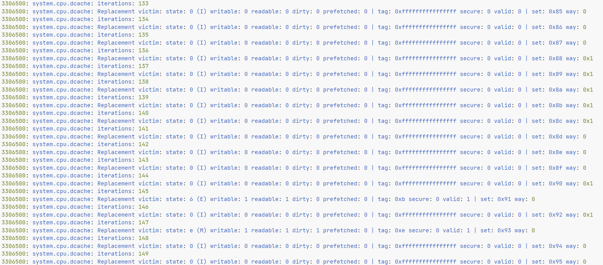
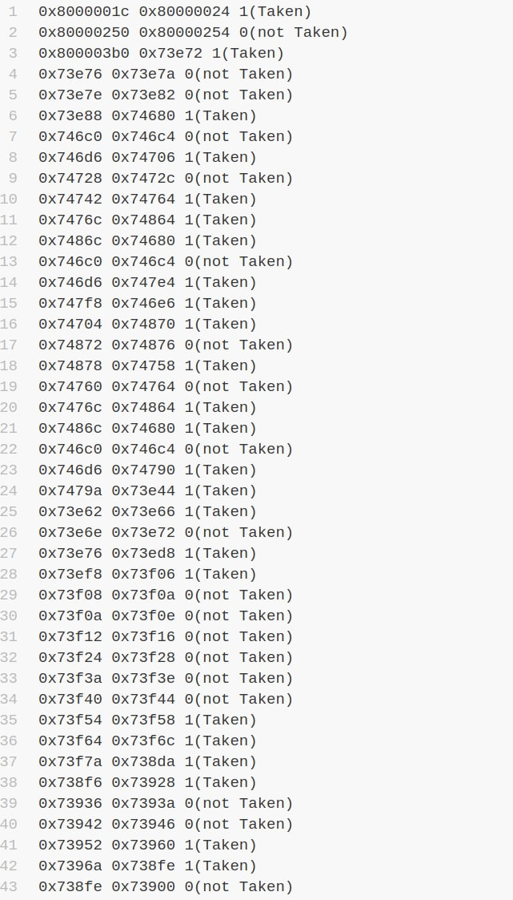
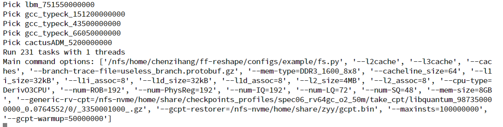
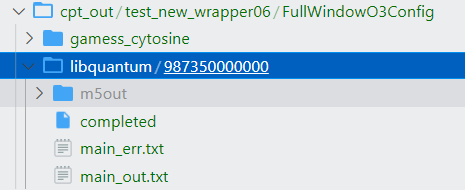
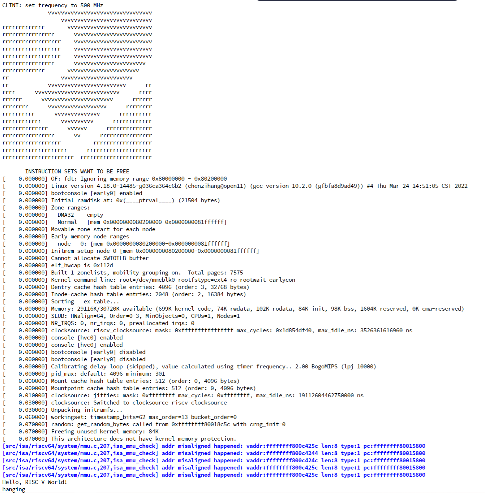
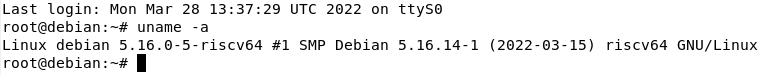
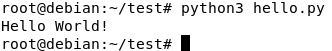
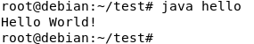
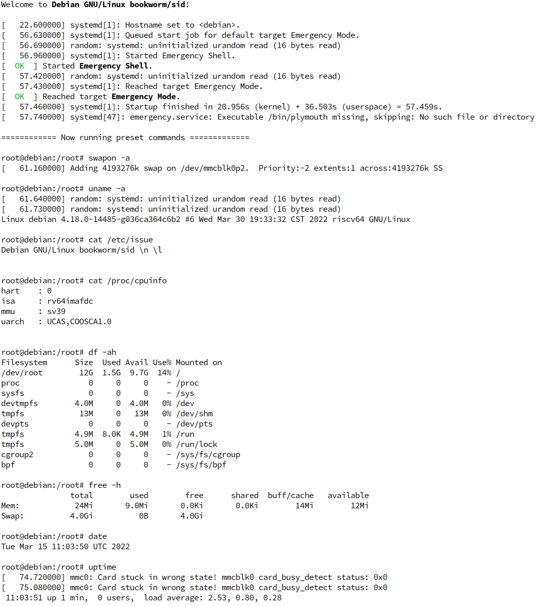
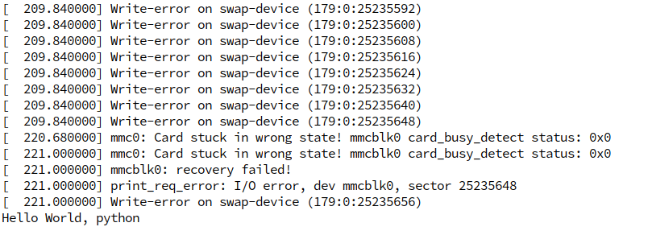

# micro-arch-learning

这是关于<a href=https://github.com/shinezyy/micro-arch-training>micro-arch-training</a>的一个learning过程，记录了@shinezyy给我布置的任务以及我们讨论过程中的一些有意义的问题

> micro-arch-learning的仓库只是一个学习过程的记录，并不是用于解答micro-arch-training的答案。micro-arch-training建立的目的并不是解决问题本身，而是学习解决过程的方法，成为一个**independent researcher**。

**周末多做做运动，不要长时间卷：）**


## 基础

1. [想做芯片？入门计算机系统结构的简略指南 - ArchShineZ的文章 - 知乎](https://zhuanlan.zhihu.com/p/400088344)

2. [【斯坦福大学】CS143 编译器（完结·中英字幕·机翻·人工校对中）](https://www.bilibili.com/video/BV17K4y147Bz?from=search&seid=18266980207417438154&spm_id_from=333.337.0.0)

3. [Wisc CS 752 Slide](https://pages.cs.wisc.edu/~sinclair/courses/cs752/fall2020/includes/schedule.html)
   1. Static ILP I
   2. Static ILP II
   3. Static ILP III / Dynamic ILP I
   4. Dynamic ILP II
   5.  Dynamic ILP III
   6.  Dynamic ILP IV
   7. Dynamic ILP V
   8. <a href="thesis/ieeemicro96_r10000.pdf">THE MIPS R10000  SUPERSCALAR  MICROPROC - Yeager</a>


## GEM5入门

### 任务目标：

1. 使用*gem5*的`gem5/configs/example/se.py`，编译一个*RISCV*的CPU，并且运行`hello`程序
2. 修改`se.py`，配置*cache*并运行`hello`程序，相关配置要求如下

``` 
16 kB L1 I-Cache 
16 kB L1 D-Cache
256kB L2 Cache
2M L3 Cache
PS: L2 and L3 Mostly-exclusive;Writeback clean
```


> 什么是**Mostly-exclusive**？
>
> 什么是**Writeback clean**?
>
> **Writeback clean**使用的原因?

3. **RISC-V** version GEM5 run **coremark**，使用编译的CPU运行`coremark`等简易的程序


> **Full system vs syscall emulation**
>
> gem5 can run in two different modes called “syscall emulation” and “full system” or SE and FS modes. In full system mode (covered later full-system-part), gem5 emulates the entire hardware system and runs an unmodified kernel. Full system mode is similar to running a virtual machine.
>
> Syscall emulation mode, on the other hand, does not emulate all of the devices in a system and focuses on simulating the CPU and memory system. Syscall emulation is much easier to configure since you are not required to instantiate all of the hardware devices required in a real system. However, syscall emulation only emulates Linux system calls, and thus only models user-mode code.


---

### 安装教程：

**相关资料：**[Getting Started with gem5](https://www.gem5.org/getting_started/)


```
git clone https://gem5.googlesource.com/public/gem5
```

*可能需要科学上网*

```
cd gem5
scons build/RISCV/gem5.opt //RISCV版本
```

---

### 任务一：

**相关资料：**[Using the default configuration scripts](https://www.gem5.org/documentation/learning_gem5/part1/example_configs/)


```
build/RISCV/gem5.opt configs/example/se.py --cmd=tests/test-progs/hello/bin/riscv/linux/hello
```

**运行结果：**


---

### 任务二：

*建议新建文件夹并复制`se.py`，在复制的`se.py`上进行修改*

**相关资料：**

1. [gem5_ Adding cache to configuration script](https://www.gem5.org/documentation/learning_gem5/part1/cache_config/)
2. [gem5-stable添加l3 cache - 台部落](https://www.twblogs.net/a/5b84c72f2b71775d1cd1cfdf)


```
cd configs/
mkdir test
cp example/se.py test/
```


> **TIPS:** cache的默认相关配置：**src/mem/cache/Cache.py** 
>
> 该文件中有关于cache类的配置以及相关注释


根据相关资料以及gem5源码对有关文件进行修改，相关文件如下：

```
configs/common/Caches.py
configs/common/CacheConfig.py
src/mem/XBar.py
src/cpu/BaseCPU.py
configs/common/Options.py
```


修改完成后，重新进行项目编译

```
scons build/RISCV/gem5.opt //RISCV版本
```


编译完成后，根据添加的argument运行`hello`程序，例如

```
build/RISCV/gem5.opt configs/example/se.py --cmd=tests/test-progs/hello/bin/riscv/linux/hello --caches --l2cache --l3cache
```


**运行结果：**


---

### 任务三

**相关资料：**[RISC-V GNU工具链的编译与安装 - 卡西莫多](https://zhuanlan.zhihu.com/p/364638851)

由于使用官方的GitHub仓库安装出现qemu等子仓库安装经常失败，因此使用国内镜像[yushulx_riscv-gnu-toolchain](https://gitee.com/yushulx/riscv-gnu-toolchain)

RISC-V GNU 工具链编译完成，需要使用命令

```
gedit  ~/.bashrc
export RISCV="/opt/riscv"     //RISCV编译链的安装位置
export PATH=$PATH:$RISCV/bin
```


安装完成后，从[riscv-boom_riscv-coremark_ Setup scripts and files needed to compile CoreMark on RISC-V](https://github.com/riscv-boom/riscv-coremark)获取RISCV version的coremark

```
git clone https://github.com/riscv-boom/riscv-coremark.git
cd riscv-coremark
git submodule update --init
./build-coremark.sh
```

编译完成后，将`coremark.riscv`文件放入gem5相关文件夹


**使用coremark进行测试**

执行命令

```
build/RISCV/gem5.opt configs/example/se.py --cmd=tests/test-progs/coremark/bin/coremark.riscv
```

**运行结果：**


使用**dhrystone**进行测试

[Keith-S-Thompson_dhrystone_ Historical versions of Reinhold P. Weicker's Dhrystone benchmark](https://github.com/Keith-S-Thompson/dhrystone)

```
git clone https://github.com/Keith-S-Thompson/dhrystone.git
cd dhrystone
cd v2.2
```

```
riscv64-unknown-elf-gcc -c  dry.c -o dry1.o
riscv64-unknown-elf-gcc -DPASS2  dry.c dry1.o  -o dry -static
```

将可执行文件**dry**放入gem5测试文件夹中，运行相关指令


**运行结果：**

*PS:左侧为default，右侧为添加cache*


**Stat.txt相关内容**

*PS:上面为默认，下面为添加cache*


---

### 新的任务

*2022.3.10*

**相关资料：**[gem5_ Event-driven programming](https://www.gem5.org/documentation/learning_gem5/part2/events/)

**在退出时Dump cache中所有的line的地址和内容**，以least import顺序导出cache，cache使用什么方法替换，我就使用什么方法导出

**TIPS：** 在更高层的地方进行dump，不接触算法本身


**WARNINGS：** gem5官方的资料中，存在部分错误：

1. `*Object.py`中函数参数有错误
2. `*.hh`以及`*.cc`文件中应该添加命名空间
3. `*Object.py`中应添加`cxx_class='*'`


一点点个人的思路：根据TIPS，我可以将一个cache，例如Dcache当做一个黑盒，Dcache的内部如何实现替换与我无关，我仅需在simulation结束的时候，通过黑盒对外的接口将内部数据导出。cache的源码中应该也是不接触算法本身，通过函数调用算法来完成替换，那我可以尝试修改源码。在查看源码的过程中，我发现了如`BaseCache::handleFill`之类操作cache的函数。我可以在结束时，伪装大量的虚假block，来使用这些虚假的block调用替换函数，获取到算法算出的将要被替换的block，并将这些block dump。

经过一段时间的尝试，我暂时选择`BaseCache::handleEvictions`来输出line的数据和地址。

对于event的处理，我阅读源码和有关资料后，决定修改src中的cpu源码，尝试在程序结束后添加一个event用于输出cache的数据。经过不断的debug，目前尝试修改`/src/cpu/base.cc`，在部分函数中添加debug-flag来查看运行过程。

接下来的很长一段时间我在寻找cpu运行的开始和结束函数，最终定位到了`AtomicSimpleCPU::suspendContext`函数，在函数中添加一些`inform()`和`debug-flag`后发现这是cpu在退出时会调用的函数，那么可以尝试在这个函数开始的位置调用一个函数发起dump操作。但是令人烦恼的是cache并不是直接包含于cpu中，而是通过`port`进行调用，因此我又花了大量的时间去探索cpu对cache调用的过程，结果发现了包括`AtomicSimpleCPU::sendPacket`、`BaseCache::CpuSidePort::recvAtomic`、`RequestPort::sendAtomic`、`AtomicRequestProtocol::send`、`BaseCache::recvAtomic`在内的函数会传递packet。因此，我修改了`packet`的源码，设置一个flag用于在结束时调用dump操作，经过一系列debug操作后，暂时能够在cpu结束程序运行时调用我在cache中自定义的函数。

然后，我开始寻找替换block的过程中调用的函数，例如`BaseCache::evictBlock`、`BaseCache::handleEvictions`、`BaseCache::allocateBlock`、`BaseCache::handleFill`、`Cache::handleAtomicReqMiss`、`BaseCache::recvAtomic`。根据这些函数，我仿写了相似的函数`Myevent*`，同时修改victim块发现后的逻辑。在发现victim块后，我直接将victim块所在的block重新插入一个新的block，来模拟写回cache的操作。暂时完成能够通过调用函数，返回给定地址后发现的victim块信息。

在调试的过程中意外地发现`victim->print()`运行后有时候会将`pkt`的`VALID_ADDR`flag消除，这让我感到意外，作为一个问题，等有空的时候排查一下。最后，在查看源码的过程中，我找到了addr的set号移位数，因此在dump操作函数中根据block的个数循环调用`allocateBlock`函数，函数的addr变量根据之前找到的移位数进行移位。最终效果能够在不确定policy的情况下，将line全部dump出来。

在重新测试的过程中发现一些小问题，并进行了修改，例如`se.py`中的dcache默认应该为512 sets。



**遗留的问题：**

> `victim->print()`函数调用为什么会修改pkt的`VALID_ADDR`flag呢？

> 为什么tag都是**0xffffffffffffffff**呢？
>
> 对于这个问题，我并不能给出很明确的解释。但是，在我重新检测并修复一些bug后，发现后面的一些victim block，它们的tag并不为0xffffffffffffffff，同时它们的victim state也不为I，而是M或者E。关于*MOESI*，我去查询了相关的资料后得知这是一种缓存一致性协议，那么根据其状态，我猜测是因为这些cache line从未写入过数据，是无效的，其tag被默认设置为0xffffffffffffffff。
>
> * Modified：This cache has the only valid copy of the cache line, and has made changes to that copy.
> * Exclusive：This cache has the only copy of the line, but the line is clean (unmodified).
> * Invalid：This block is not valid; it must be fetched to satisfy any attempted access.

最后，在查看@Shinezyy的仓库里的正确写法后，发现自己大部分工作都是错误的。对于结束后调用，我们可以调用一个名为`registerExitCall()`的函数来完成；对于dump cache，我们可以在`BaseSetAssoc`类中调用一些函数来完成。

---

### Dump Branch Result

**任务要求：** TimpingSimple CPU中增加一个dump 跳转指令结果的功能，在gem5退出的时候，Dump最近X条控制指令（分支、跳转）的方向、地址


有了上个任务的经验以后，这个任务就比较简单了。只需按照上个任务的思路，在TimpingSimple CPU源码中添加一个dump函数并为option添加相关代码，最后通过`registerExitCall()`函数在结束时调用就可以了。CPU源码中有存储指令状态的数据结构，可以获取到该指令的PC，下一条指令PC和跳转结果，我们只需在运行时将指令状态存储到queue中，在程序结束时输出即可。

> 由于压缩指令的存在，不可以单纯的用PC == nextPC + 4来判断是否跳转

**运行结果：**




---

### Batch running

2022.3.24

Tool Task: 利用[BatchTaskTemplate](https://github.com/shinezyy/DirtyStuff.git)批量运行GEM5。 具体地，拷贝一份`gem5tasks/restore_gcpt.py`，仔细阅读注释，修改里面的配置，把GEM5批量跑起来。

这个任务相对来说还是比较简单的，主要是对几个文件目录的修改。但是，仓库中仅拥有SPEC06的Simpoint的相关文件，SPEC17的whitelist是缺失的，因此无法启动任务。如果想要运行SPEC17相关，需要使用`points/select_points.py`对SPEC17相关文件进行生成。

> 对于生成文件的相关参数解释：
>
> max2: 每个workload选最多2个point
>
> cover0.5：每个workload选够0.5的coverage的点

使用前应在`DirtyStuff`文件夹中使用`export PYTHONPATH=$(pwd)`，结束时使用`Ctrl+C`时应加上`killall -15 gem5.opt`

**TIPS：`common/local_config.ly`中的`--l3_cache`选项与我们使用的Gem5工具中的选项并不匹配，需要修改**


**运行结果：**






## Debug


> 为什么**coremark**运行了十几分钟或者更久的时间仍然没有出现结果？
>
> gem5出现问题还是coremark本身有问题？
>
> 如何根据出现的问题进行debug？


1. 使用difftest
2. 使用qemu，如qemu static、qemu user


安装**qemu**

```
sudo apt-get install qemu-user-static
```

使用**qemu-riscv64-static**运行*coremark*

```
qemu-riscv64-static coremark.riscv
```


**运行结果：**


> 说明并非编译出现问题，coremark.riscv可执行文件编译正确


对**coremark**源码进行修改

```c
results[0].iterations=500 //riscv-coremark/coremark/core_main.c 114行 手动设置为500次，不可太低
```

```c
#define NSECS_PER_SEC 10000000 // TODO: What freq are we assuming? 降低频率适应iteration，保证运行至少10秒
```

```
./build-coremark.sh
```


gem5中重新运行**coremark.riscv**

```
build/RISCV/gem5.opt configs/example/se.py --cmd=tests/test-progs/coremark/bin/coremark.riscv
```

**运行结果：**


增加cache后重新运行**coremark.riscv**

```
build/RISCV/gem5.opt configs/example/se.py --cmd=tests/test-progs/coremark/bin/coremark.riscv --caches --l2cache --l3cache
```

**运行结果：**


> 从增加cache的stat.txt中意外发现l2cache和l3cache的cache hit和miss数据相同？
>
> coremark的局部性太好，除了开始冷启动时发生的miss，程序运行的指令和数据在Icache中通常可以找到，对写入l2cache的需求少，因此l2cache和l3cache的hit和miss数据相同，这一现象可以用stat.txt中写入l2cache的数量极少的事实来验证


## SIMPoint

**相关资料：** 

1. <a href="thesis/Basic_block_distribution_analysis_to_find_periodic_behavior_and_simulation_points_in_applications.pdf">Basic block distribution analysis to find periodic behavior and simulation points in applications</a> **PS：这篇文章过于古老，用处不太大**
2. [关于SimPoint的一些碎碎念 - 知乎](https://zhuanlan.zhihu.com/p/380561873)
3. <a href="thesis/ASPLOS-02-SimPoint.pdf">Automatically Characterizing Large Scale Program Behavior</a>


>  SimPoint的一个优点：与具体的体系结构无关


> 体系结构和微体系结构？
>
> shinezyy：体系结构是指程序员可见的，如寄存器之类的能被gdb查看的


## 生成Rootfs和kernel并启动

@Shinezyy似乎忘记在他的仓库里加上这个任务了：）

任务指引：[Linux Kernel for XiangShan in EMU](https://github.com/OpenXiangShan/XiangShan-doc/blob/main/tutorial/others/Linux%20Kernel%20%E7%9A%84%E6%9E%84%E5%BB%BA.md)

**过程中的一些问题：** 大部分的工作可以根据md指引完成，除了生成Rootfs！！！编译Rootfs时会失败，首先是怀疑RiscV编译链的选择，但是更改为`RV64GC`后仍然出现相同问题，暂时搁置不管。另外一个小问题是在运行NEMU时，遭遇了assert问题，对于这个问题，我们需要注释掉提示里的`assert 0`。

**TIPS：NEMU仓库里有配置好的config，不需要自己调整**

> @shinezyy：主要是配置好kernel，然后编bbl，编bbl的时候会自动把kernel填到bbl后面，NEMU只需要用bbl.bin启动就可以了


**运行结果：**




## QEMU启动Debian

**任务介绍:** 使用**qemu**运行**riscv64**版本的**debian**，并且启动**python**和**java**

**完成过程:** 关于使用qemu启动riscv64的debian，网上相关的教程很多，个人推荐知乎上的一篇教程[Debian RISC-V构建 - 知乎](https://zhuanlan.zhihu.com/p/440467508)，但是需要注意的是，宿主机系统建议与文中所用的系统保持一致，因为我在Ubuntu 20.04LTS上安装时是无法成功的，但是切换到Debian11后可以完成安装。完成debian的启动后，python和java启动就十分简单了，可以使用`apt-get install *`命令直接安装，值得注意的是由于源的问题，安装过程长达数个小时。安装完成后，编写了简单的测试程序并进行测试，python和java可以正常使用。


**任务结果:**








## NEMU启动Debian

**任务要求：**

- 用RV qemu启动debian sdcard，在sdcard上装好java和python的环境
- 通过emergency mode让debian启动后第一条命令运行java或python
- 用NEMU启动这个sdcard 镜像

**相关资料：**

* [riscv64 debian镜像制作](https://github.com/OpenXiangShan/NEMU/tree/master/resource/debian)
* [Linux Kernel for XiangShan in EMU](https://github.com/OpenXiangShan/XiangShan-doc/blob/main/tutorial/others/Linux%20Kernel%20%E7%9A%84%E6%9E%84%E5%BB%BA.md)


这个任务大部分工作都比较简单，主要是由于源的原因导致的下载速度极慢以及镜像在物理机和服务器之前传输的时间较长。值得注意的是以下问题，首先是宿主机系统，亲测Ubuntu20.04LTS以及Debian11都是不可行的，或者存在部分问题的，建议按照资料中的要求使用Debian10。除此之外，在安装部分软件时无法成功，并且提示*the keytool command requires a mounted proc fs (/proc).*，使用`mount -t proc proc /proc`可以解决该问题，但是在`exit`退出chroot之前，必须将`/proc` umount，否则无法执行指令`sudo umount /mnt`，最终导致镜像出现问题，无法在NEMU中正常启动。在nemu启动Debian时可能会出现*No filesystem could mount root*的问题，结合上下文，发现是bootargs cmd的问题，在`riscv-pk/dts/platform.dtsi`中修改相应代码为`/dev/mmcblk0p1`即可。

**存在的问题：** 目前存在问题，`javac`目前没有出现结果，可能是swap分区无法写入的原因和java性能原因

> 大量输出write-error on swap-device的原因？
>
> @shinezyy：nemu不支持sdcard写入，所以得写到ramfs


**运行结果：**






## 如何正确地阅读论文

Google Scholar中搜索需要阅读的论文题目，然后点击**被引用的次数**，查看相关的较新的论文


## 引用

[1] ArchShineZ.想做芯片？入门计算机系统结构的简略指南[EB/OL].(2021-8-15)[2022-3-8].https://zhuanlan.zhihu.com/p/400088344

[2] 鬼谷良师.【斯坦福大学】CS143 编译器（完结·中英字幕·机翻·人工校对中）[EB/OL].(2020-6-21)[2022-3-8].https://www.bilibili.com/video/BV17K4y147Bz?from=search&seid=18266980207417438154&spm_id_from=333.337.0.0

[3] Matthew D. Sinclair.CS_ECE 752 Fall 2020[EB/OL].(2020)[2022-3-8].https://pages.cs.wisc.edu/~sinclair/courses/cs752/fall2020/includes/schedule.html

[4] Kenneth C. Yeager.THE MIPS RIO000 SUPERSCALAR MICROPROC[J].IEEEMicro,1996.

[5] gem5.org.gem5_ Getting Started with gem5[EB/OL].[2022-3-8].https://www.gem5.org/getting_started/

[6] gem5.org.gem5_ Using the default configuration scripts[EB/OL].[2022-3-8].https://www.gem5.org/documentation/learning_gem5/part1/example_configs/

[7] gem5.org.gem5_ Adding cache to configuration script[EB/OL].[2022-3-8].https://www.gem5.org/documentation/learning_gem5/part1/cache_config/

[8] tristan_tian.gem5-stable添加l3 cache[EB/OL].(2018-08-28)[2022-3-8].https://www.twblogs.net/a/5b84c72f2b71775d1cd1cfdf

[9] 卡西莫多.RISC-V GNU工具链的编译与安装 [EB/OL].(2022-3-4)[2022-3-8].https://zhuanlan.zhihu.com/p/364638851

[10] yushulx (2020) riscv-gnu-toolchain[source code].https://gitee.com/yushulx/riscv-gnu-toolchain/commits/master.

[10] riscv-boom (2019) riscv-coremark[source code].https://github.com/riscv-boom/riscv-coremark.

[11] Keith-S-Thompson (2012) dhrystone[source code].https://github.com/Keith-S-Thompson/dhrystone.

[12] Timothy Sherwood,Erez Perelman,Brad Calder.Basic Block Distribution Analysis to Find Periodic Behavior and Simulation Points in Applications[J].IEEE,2001.

[13] Timothy Sherwood,Erez Perelman,Greg Hamerly,Brad Calder.Automatically Characterizing Large Scale Program Behavior[J].ACM SIGPLAN Notices,2002.

[14] gem5.org.gem5_ Event-driven programming[EB/OL].[2022-3-11].https://www.gem5.org/documentation/learning_gem5/part2/events/

[15] Jean.Debian RISC-V构建[EB/OL].(2021-12-3)[2022-3-28].https://zhuanlan.zhihu.com/p/440467508

